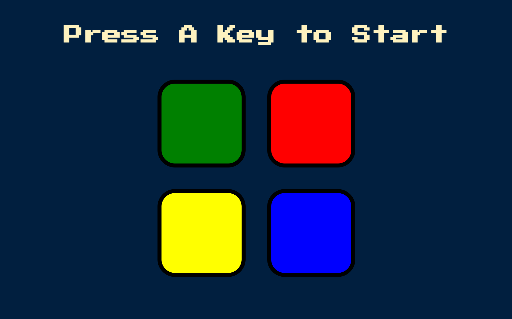

# 🎵 Simon Game 🎵

A fun and challenging **memory game** built with HTML, CSS, and JavaScript.  
Repeat the sequence of colors as it gets longer with each round—how far can you go? 🧠✨

🌐 **Live Demo**: [Play Simon Game](https://catheringino.github.io/SimonGame/)

---

## 📸 Preview


---

## ✨ Features
- 🎨 Four colored buttons: Green, Red, Yellow, Blue
- 🧠 Test and improve your memory
- ⌨️ Start the game by pressing any key
- 🔊 Sound effects and animations for each button
- 🚀 Increasing difficulty as the sequence grows

---

## 🛠️ Technologies Used
- **HTML5** – Structure of the game
- **CSS3** – Styling and animations
- **JavaScript (Vanilla)** – Game logic, sequence generation, and user input handling

---

## 🚀 How to Play
1. Open the [Simon Game](https://catheringino.github.io/SimonGame/).
2. Press **any key** to start.
3. Watch the sequence of flashes and sounds.
4. Repeat the sequence by clicking the buttons in the correct order.
5. The sequence grows longer each round—don’t make a mistake, or the game will restart!

---

## 📂 Installation & Setup
If you want to run this project locally:
```bash
# Clone the repository
git clone https://github.com/CatherinGino/SimonGame.git

# Open the folder
cd SimonGame

# Open index.html in your browser
